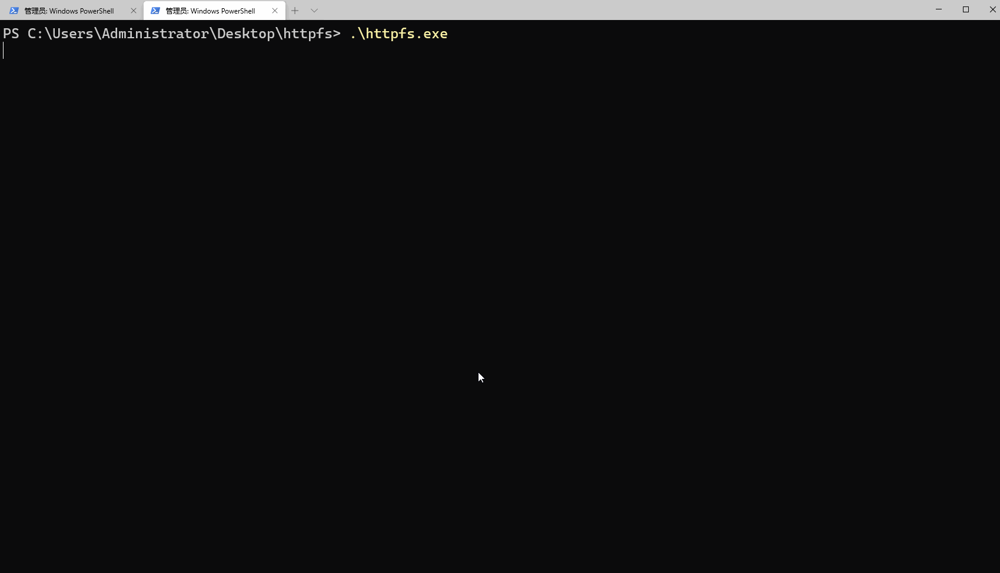

# httpfs
一个简单的静态文件服务器，支持拖拽上传文件，目的在于解决内网共享文件的问题。

[English](README_en.md)


[](https://github.com/hellojukay/httpfs/actions/workflows/go-build.yml)

#  安装
```shell
// 需要 golang 1.16 以及以上版本
 go install github.com/hellojukay/httpfs@latest
 
httpfs --version
v0.5.0 h1:tgPLWu1eBpYuH9dSOl1xdODpbYBbS9CeMp84BfcCOcw=
```

 命令行上传文件
 ```shell
 curl -T filename http://127.0.0.1:8080/direcotry/
 ```

 浏览器上传文件


# 特性
* 单文件，免安装，静态编译无依赖
* 支持Linux,Windows,Mac OSX 等
* 拖拽上传
